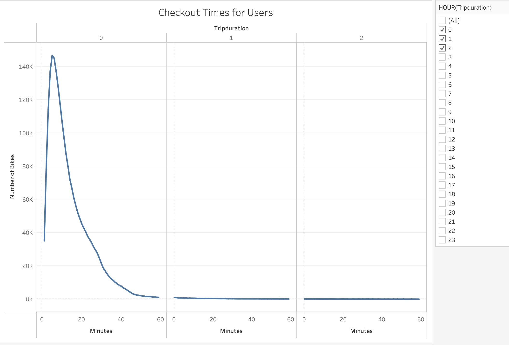
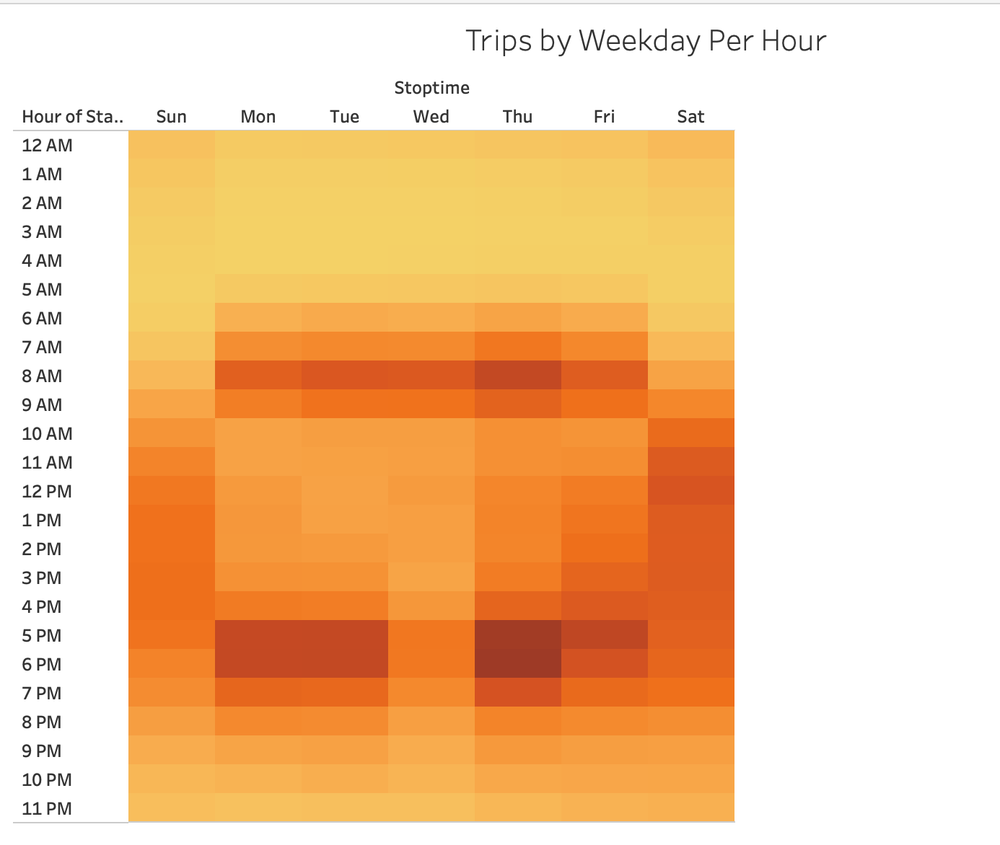
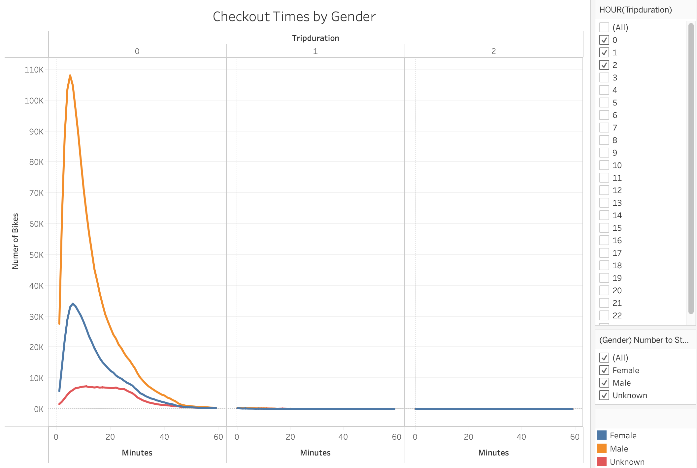
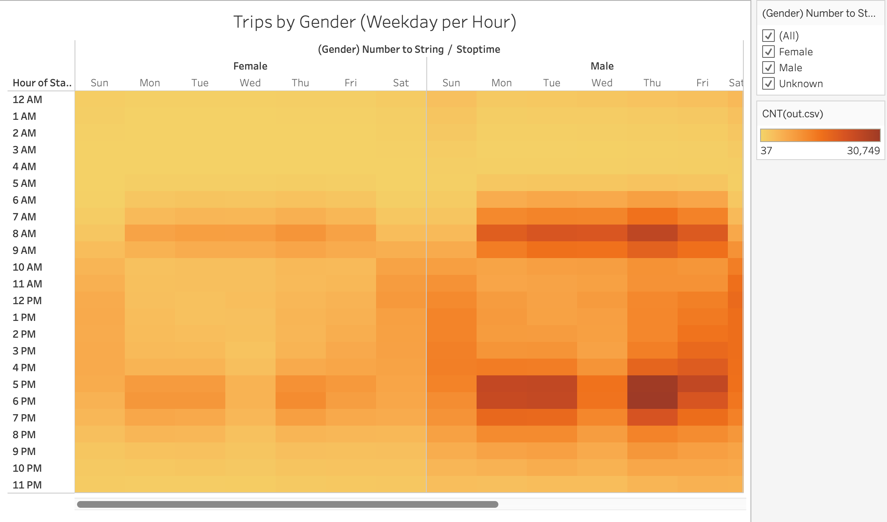
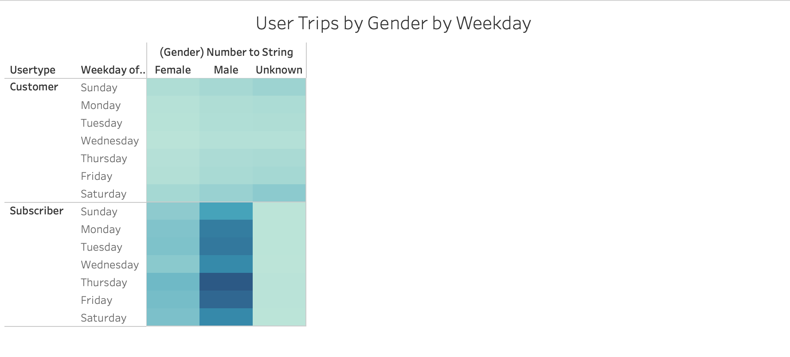
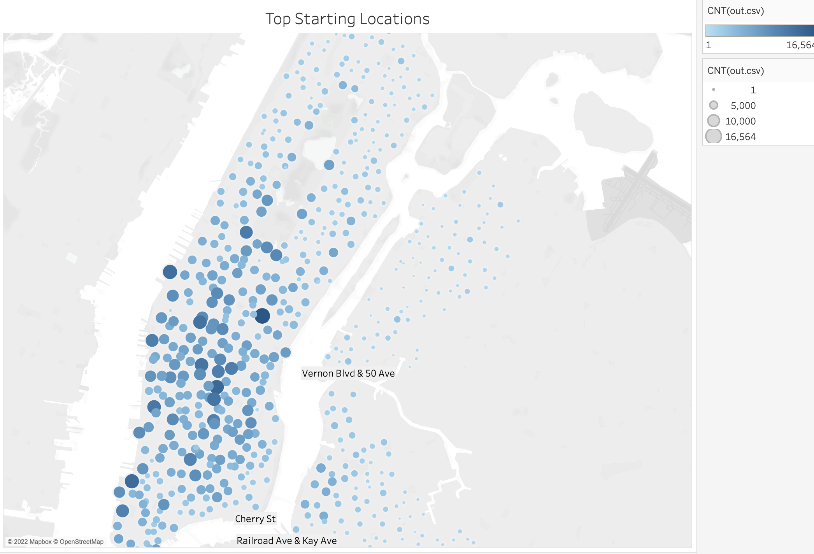
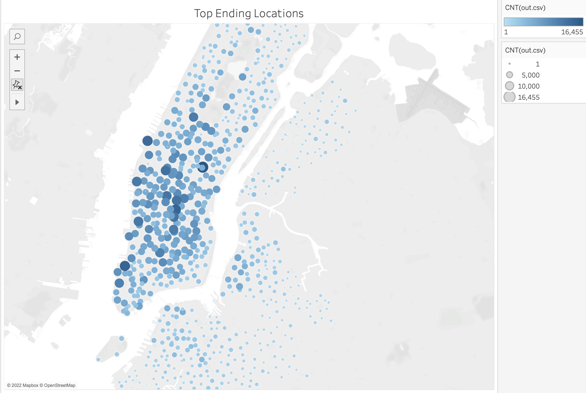
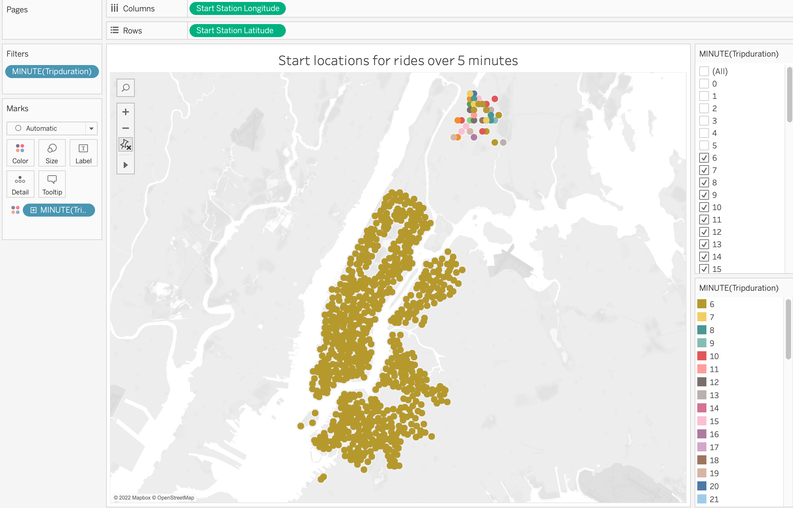
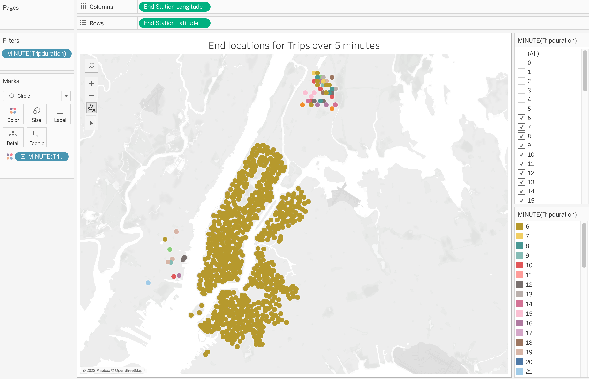

# Bikesharing

## Overview of analysis
The purpose of this analysis is to use the already existing data form NYC CITI Bikesharing  as a proof of concept for the viablity of a similiar business model in Des Moines.

## Results

This sheet illustrates that the majority of bikes  are used for trips that take less than  5 minutes.

The busiest times of bike usage during the week are typically rush hours i.e 6-9 am and 4-8 pm. On weekends the most used times are between 10 am and 8 pm.

Of the identifiable genders males were the predominant users of the bikes by over 300% when measuring rides lasting up to 5 minutes. 

When considering time of usage , both males and females typically used the bikes around similiar times during the week and on weekends.

Of the total usage the majority of bike users were subscribers which suggests consistnt repeated usage . It also noteworthy that over 75% of total users are subscribers.

Most rides start in Manhattan which is the hub of the financial and entertainment district in NYC.

Being that we already know that most bikes are used for 5 minutes or less it should come as no surprise that the end locations are quite close to the start locations.

## Summary 
Based on the information gathered it is quite clear that the NYC Citi Bikesharing platform is very successful . There is a strong user base that while predominantly male is consistent throught all days of the week . I beliave that a similiar business model could be replicated in Des Moines without much trouble. 
It was also noted through further analysis that rides lasting longer that 5 minutes and up to an hour had a noticeable footprint outside of the Manhattan core as is demonstrated by the following images :

 

## Tableau

[Link to dashboard](https://public.tableau.com/app/profile/harry3568/viz/CitiBikeProject_16441789050420/CitiBikeProjectAnalysis#1)